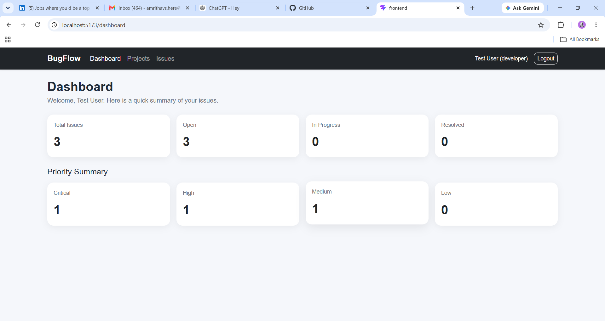
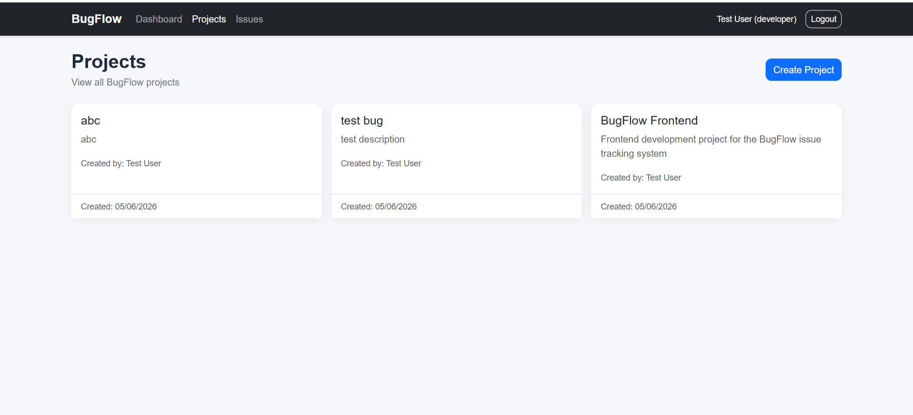
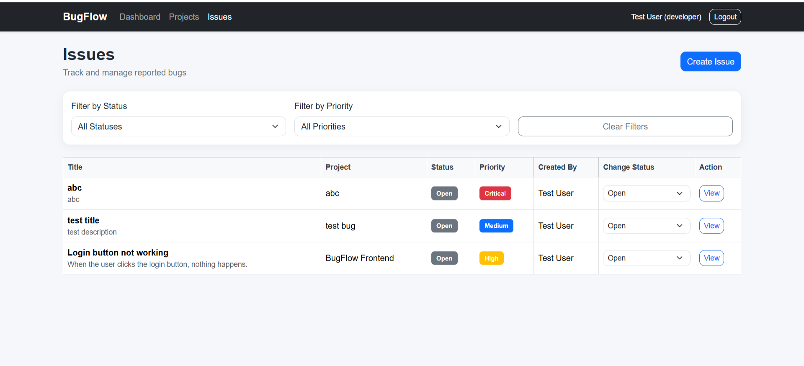
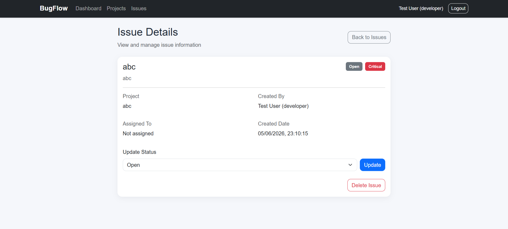

# BugFlow

BugFlow is a MERN stack bug and issue tracking web application. It helps users create projects, report issues, track issue status, filter bugs by priority or status, and view a dashboard summary.

This project was built as a full-stack portfolio project to demonstrate authentication, protected routes, REST APIs, MongoDB integration, and basic issue management workflows.

## Features

### Authentication

* User registration
* User login
* JWT-based authentication
* Protected frontend routes
* Protected backend APIs

### Dashboard

* Total issues count
* Status-wise issue summary
* Priority-wise issue summary

### Project Management

* Create projects
* View all projects
* Track who created each project

### Issue Management

* Create issues under a project
* View all issues
* Filter issues by status
* Filter issues by priority
* Update issue status
* View detailed issue information
* Delete issues

## Tech Stack

### Frontend

* React
* Vite
* React Router DOM
* Axios
* Bootstrap

### Backend

* Node.js
* Express.js
* MongoDB
* Mongoose
* JWT
* Bcrypt.js
* CORS
* Dotenv

## Folder Structure

```text
bugflow/
  backend/
    config/
    controllers/
    middleware/
    models/
    routes/
    server.js
  frontend/
    src/
      components/
      pages/
      services/
      App.jsx
      main.jsx
  README.md
```

## API Endpoints

### Auth Routes

```text
POST /api/auth/register
POST /api/auth/login
GET  /api/auth/profile
```

### Project Routes

```text
POST /api/projects
GET  /api/projects
GET  /api/projects/:id
```

### Issue Routes

```text
POST   /api/issues
GET    /api/issues
GET    /api/issues/summary
GET    /api/issues/:id
PUT    /api/issues/:id/status
DELETE /api/issues/:id
```
## Screenshots

### Dashboard


### Projects


### Issues


### Issue Details



## Future Improvements

* Assign issues to specific users
* Add comments on issues
* Add role-based access control
* Add charts to dashboard
* Add search functionality
* Add project details page
* Improve UI design

## Project Status

Core features are completed. 

